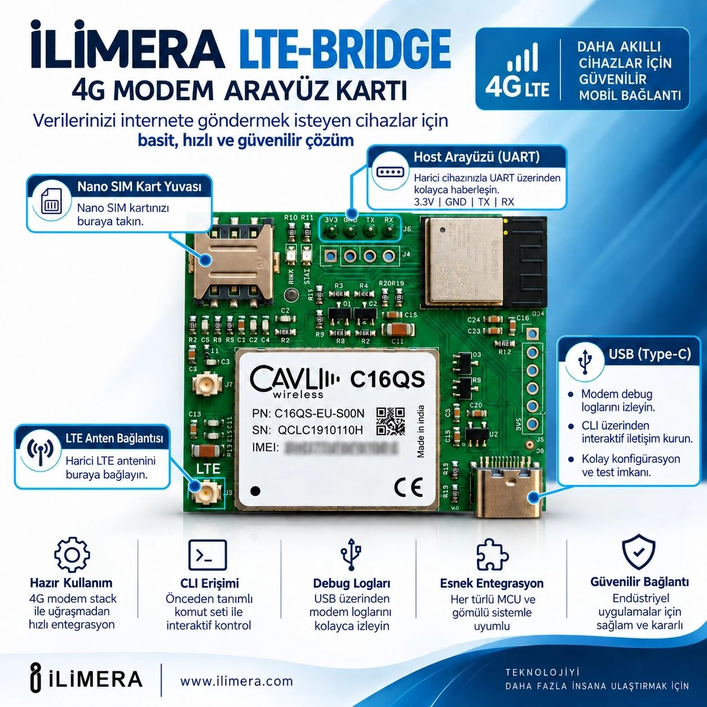
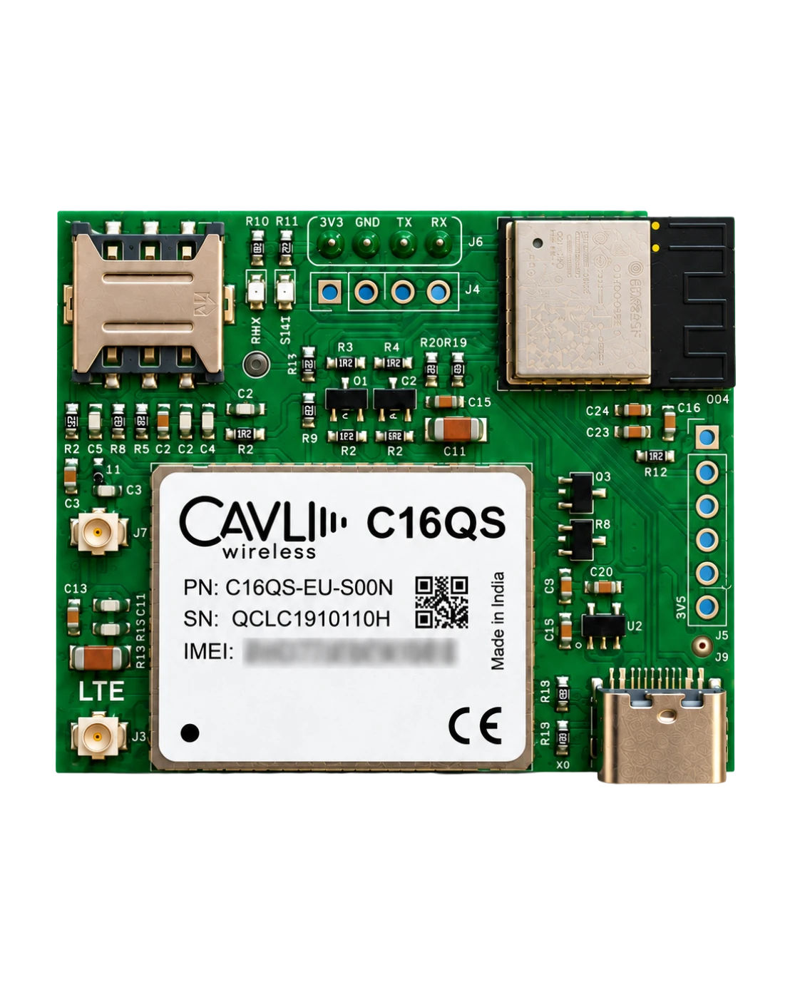

# İLİMERA LTE Bridge — 4G Modem Interface Board

[Türkçe](README.md) · [Product page](https://ilimera.com/en/urunler/gelistirme-kartlari/lte-bridge) · [User guide (PDF, Turkish)](docs/ILIMERA_LTE_Bridge_kullanici_kilavuzu_v1.pdf) · [Protocol reference (Turkish)](docs/PROTOKOL.md)



**Take your device online without writing a single AT command.** Send one line of JSON over UART, read one line
back. SIM handling, network registration, APN, the TCP stack, TLS certificates and reconnecting after a dropped
link all happen on the board. Even an 8-bit microcontroller that can build a JSON string and read a line from a
serial port can make HTTPS requests.

```text
host → bridge   {"cmd":"req","id":1,"url":"https://api.example.com/v1/status"}
bridge → host   {"id":1,"acc":true}
bridge → host   {"id":1,"ok":true,"status":200,"ctype":"application/json","body":"{\"state\":\"idle\"}"}
```

## Features

| Feature | Value |
| --- | --- |
| Cellular module | Cavli C16QS, 4G LTE |
| Host interface | UART (J6): 3V3, GND, TX, RX — 115200 baud 8N1, 3.3 V logic |
| Host protocol | Single-line JSON request / response, newline terminated |
| Requests | HTTP and HTTPS: GET, POST, PUT, DELETE with your own headers and body |
| Security | Verified TLS with an embedded root certificate store, encrypted flash |
| Power and service | USB Type-C (power + service console) |
| SIM / antenna | Nano SIM (push-push), LTE antenna U.FL/IPEX |
| Updates | Automatic over-the-air updates for the bridge and the modem |
| Limits | Request line 2048 bytes, response body 4096 bytes, queue of 4, timeout up to 30 s |

Planned (delivered by over-the-air update): MQTT, raw TCP/UDP sockets, TLS sockets and DTLS. Every request carries
a `"cmd"` field, so host code written today keeps working when new commands arrive.

## Connections



| Connection | Details |
| --- | --- |
| **Nano SIM socket** | Push-push. Contacts facing the PCB, cut corner matching the mark; insert with power off. The network usually provides the APN |
| **LTE antenna** | U.FL/IPEX connector marked LTE. Attach before powering the board |
| **Host UART (J6)** | 3V3 · GND · TX · RX. Board TX → host RX, board RX → host TX, GND → GND. A 5 V host needs a level shifter |
| **USB Type-C** | Power and service console (115200 baud virtual serial port), fully separate from the host line |

| Status LED | Meaning |
| --- | --- |
| Blinking (twice a second) | No internet yet: booting, reconnecting or self-recovering |
| Steady on | Connected; requests can be served |

## Quick start

1. **Insert the SIM** (Nano, power off).
2. **Attach the antenna**: press the U.FL plug straight onto the LTE connector until it clicks.
3. **Wire your device to J6**: cross TX/RX, common GND, 115200 8N1, 3.3 V.
4. **Power over USB-C.** Optionally open the virtual serial port at 115200 to watch the boot log.
5. Wait for `internet OK` and a steady LED. The host line receives `{"evt":"ready","fw":"0.2.6"}`; you can now
   send requests.

## Four rules for host code

1. Send each request as **one line** ending with **`\n`**.
2. **Wait for the result line** before sending the next request (one request is processed at a time).
3. `ok:false` with `status` → the server rejected it, do not retry. No `status` → unreachable, retry later.
4. An unexpected `{"evt":"ready"}` means the bridge restarted: resend the request you were waiting for.

## Troubleshooting

| Symptom | Where to look |
| --- | --- |
| LED keeps blinking | No data link: antenna seated, SIM inserted and active, coverage? The console log shows which step failed |
| Nothing on the USB serial port | The console is quiet after boot by design: press Enter or type `log` |
| Requests return `err:"no_link"` | Link dropped; the board is already reconnecting, retry shortly |
| Requests return `err:"no_time"` | Clock not set yet; clears a few seconds after connecting |
| Requests return `err:"busy"` | Too many requests at once; wait for each result line |
| No reply at all | Type `host` in the console: `rx bytes` 0 means wiring/logic level; bytes but no `lines` means a missing `\n` |
| Board seems stuck after an update | Leave it powered for 15 minutes; if the new firmware cannot get online it rolls back automatically |

All fields, error codes and console commands: [docs/PROTOKOL.md](docs/PROTOKOL.md).

## Support

User guide, updates and support: [ilimera.com](https://ilimera.com/en/urunler/gelistirme-kartlari/lte-bridge).
Open an **Issue** in this repository for bugs and suggestions.

To drive the modem directly with AT commands, see the
[CAVLI GSM/LTE Devboard](https://github.com/ILIMERA-public/CAVLI-GSMLTE-Devboard) repository, which uses the same
Cavli C16QS module.

İLİMERA LTE Bridge is developed by İLİMERA Technology.

## License

The example code is provided under the [MIT License](LICENSE); you are free to use it in your own products.
Technical documents and images are the property of İLİMERA Technology.
